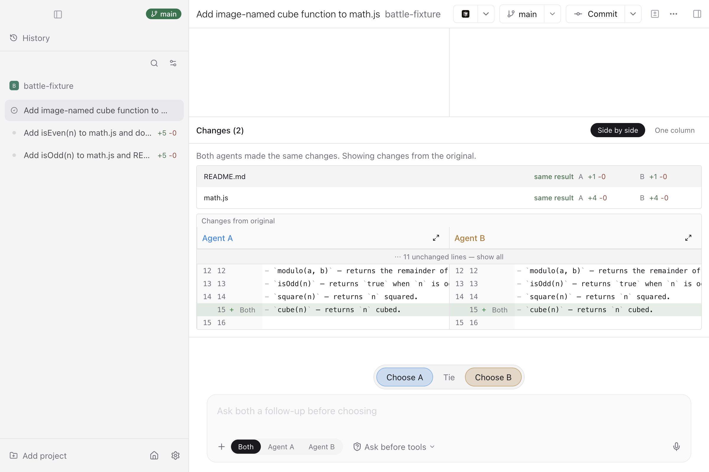

<p align="center">
  
</p>

<h1 align="center">Agent Duel</h1>

<p align="center">A desktop coding-agent battle interface built on Paseo.</p>

Agent Duel runs two blinded coding agents against one prompt in isolated local
worktrees. You compare their results, choose A, B, or Tie, and continue from the
selected result as ordinary chat history.

Each contestant is a model drawn at random [from a pool](#current-models) and run
through the bundled engine. You only see which models they were after you vote.

<p align="center">
  
</p>

The shipped product is the Electron desktop app. `packages/app` can run in a
browser during development and automated QA, but there is no hosted browser
product.

## Download

[Download for macOS (Apple silicon)](https://github.com/bottomless/agent-duel/releases)

E-mail signup required for use. No cost for unlimited inference with frontier models.

## Current models

The hosted version draws from:

- Claude Opus 5
- Kimi K3
- Qwen 3.8 Max
- GPT-5.6 Sol

## Architecture

Execution stays on your machine:

```text
Electron UI -> local daemon -> local Arena runtime -> local repositories and agents
                                       |
                                       |-> Agent Duel cloud -> OpenRouter (official download)
                                       `-> OpenRouter (your key in a BYOK build)
```

The UI WebSocket terminates at the local daemon. The packaged desktop
application contains the daemon, renderer, and compiled Arena runtime.

The official download uses Agent Duel's cloud service for sign-in, model
assignments, and model calls. The cloud service is closed source and maintained
outside this repository.

Arena history is canonical on the desktop: SQLite records live under
`$PASEO_HOME/arena/arena.sqlite` and artifact bytes under
`$PASEO_HOME/arena/artifacts/sha256/`.

Read [docs/architecture.md](docs/architecture.md) for the complete system design
and [docs/arena.md](docs/arena.md) for the battle.

## Develop locally

Local development requires no sign-in. Battles run on your own OpenRouter key,
and votes are not uploaded.

### Requirements

- macOS or Linux
- Node.js 22 with npm
- Bun 1.3.14
- An OpenRouter API key

Install both package graphs, then start the desktop stack in bring-your-own-key
mode from the repository root:

```bash
npm install
cd arena-backend && bun install && cd ..
npm run dev:desktop -- --byok
```

The launcher prepares an isolated checkout-local environment and starts the
local daemon, the Electron-flavoured Expo server, and Electron. It reports
`[dev] healthy:` when the stack is ready. Paste your OpenRouter key in Settings;
battles run on that key.

### Troubleshooting

- If a dependency is missing, run `npm install` at the root and `bun install` in
  `arena-backend`.
- If a port is busy, leave the daemon, Expo, and debugger ports unset where
  supported so the launcher can choose free ports.
- Inspect `.dev/paseo-home/daemon.log` for daemon failures.

See [docs/development.md](docs/development.md) for worktrees, multiple instances,
Playwright/Chrome testing, logs, and focused validation commands.
To package the desktop app with hosted sign-in or your own OpenRouter key, see
[the desktop build instructions](docs/deployment.md#build-the-macos-desktop-application).

## Repository map

- `arena-backend/packages/opencode` — local Arena engine compiled into desktop.
- `arena-backend/packages/arena-service` — battle routes (model draw, model proxy,
  comparison) shared with the hosted service.
- `packages/desktop` — Electron shell, daemon supervision, and packaging.
- `packages/app` — shared renderer; browser execution is a development/QA surface.
- `packages/server` — local daemon, WebSocket API, and agent lifecycle.
- `packages/protocol` and `packages/client` — local wire protocol and client SDK.
- `packages/cli` — local daemon CLI bundled with desktop.
- `packages/relay` — inherited optional remote-access transport.

## Common commands

```bash
npm run dev:desktop -- --byok        # Complete local desktop stack on your OpenRouter key
npm run dev                          # Local daemon only
npm run dev:app                      # Browser-based development/QA renderer
npm run build:server                 # Build daemon and shared packages
npm run typecheck
npm run lint
npm run format
```

## Contributing

See [CONTRIBUTING.md](CONTRIBUTING.md). Questions and help: [SUPPORT.md](SUPPORT.md).
Security: [SECURITY.md](SECURITY.md). Everyone taking part follows the
[Code of Conduct](CODE_OF_CONDUCT.md).

## License

- Everything outside `arena-backend/` is AGPL-3.0-or-later. Agent Duel is a fork
  of [Paseo](https://github.com/getpaseo/paseo), copyright Mohamed Boudra, with
  modifications by Bottomless. See [LICENSE](LICENSE).
- `arena-backend/` is MIT. It is a fork of
  [OpenCode](https://github.com/anomalyco/opencode), copyright opencode, with
  modifications by Bottomless. See [arena-backend/LICENSE](arena-backend/LICENSE).
- Third-party components keep their own licences.

[NOTICE](NOTICE) has the full mapping. The hosted Agent Duel service is not part
of this repository.
